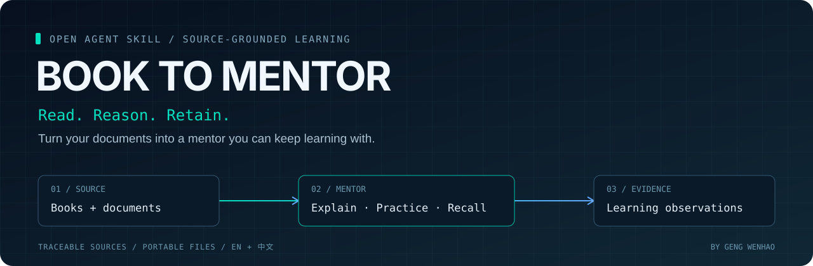
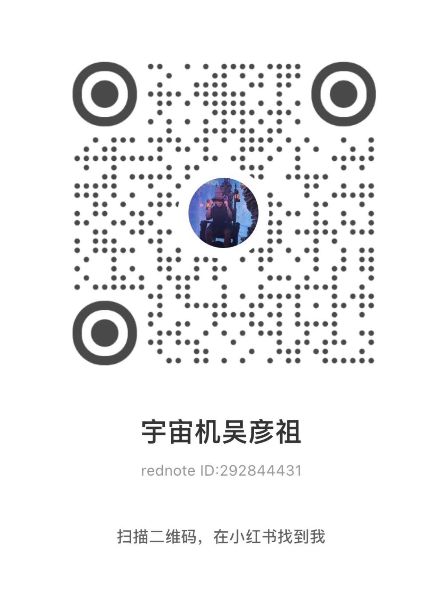

<p align="center"></p>

<p align="center">
  <a href="README.md">English</a> · <a href="README.zh-CN.md">简体中文</a><br>
  <a href="https://github.com/gengwenhao/book-to-mentor/actions/workflows/tests.yml"></a>
  <a href="https://github.com/gengwenhao/book-to-mentor/releases"></a>
  <a href="https://skills.sh/gengwenhao/book-to-mentor"></a>
  <a href="LICENSE"></a>
</p>

# 让下一本书，成为你的下一位导师。

Book-to-Mentor 把书籍或文档转成可反复使用的 AI 导师 Skill：讲解有出处，练习跟随你的意图，学习记录跨对话保留。

**不止读出一份摘要，而是拥有一个可以继续学习的地方。**

| 蒸馏 Distill | 教学 Mentor | 记录 Remember |
| --- | --- | --- |
| 提炼概念与框架，标注来源位置，按需加载章节。 | 自由切换引导练习、直接讲解和快速查阅。 | 区分提示后答对、独立应用和延迟回忆。 |

这是由 **Agent 执行的工作流**，不是独立阅读器。脚本负责提取与校验，Agent 负责生成导师与教学。目前没有真人长期学习效果研究，不承诺固定学习提升比例。

## 一条命令，开始使用

```bash
npx skills add gengwenhao/book-to-mentor --skill book-to-mentor
```

然后把本地书籍或文档交给 Agent：

```text
用 book-to-mentor 把 /path/to/book.pdf 转成导师 skill。
先做第一章，用中文教学，输出到当前工作区。
```

接着试试：“直接讲解这一节”“问我一道应用题”“接着上次继续学”。默认产物位于 `mentors/<slug>-mentor/`。后续追加材料时，保留已有教学规则和学习记录。

需要能读写本地文件、运行 Python 3.10+ 的 Agent。文本、Markdown、HTML、EPUB、DOCX 使用标准库；PDF 需要 `pypdf` 或 `pdfminer.six`，RTF 需要 `striprtf`，技术型 PDF 可选 `docling`。[格式、依赖和限制 →](docs/formats.zh-CN.md)

## 选择你的使用平台

| 渠道 | 当前支持 | 更新方式 |
| --- | --- | --- |
| [Agent Skills / skills.sh](https://skills.sh/gengwenhao/book-to-mentor) | 从本仓库安装自包含 Skill | 通过 skills CLI 更新或重新安装，不会静默覆盖用户副本 |
| Codex / ChatGPT 插件宿主 | 本仓库的自建 marketplace | 刷新市场，再更新或重装插件 |
| Claude Code | 本仓库的插件 marketplace | 刷新市场并更新插件；可在宿主中选择自动更新 |
| [GitHub Releases](https://github.com/gengwenhao/book-to-mentor/releases) | 带版本的 Skill、插件 ZIP 和校验和 | 发布标签自动生成 |
| [ClawHub / OpenClaw](https://clawhub.ai/gengwenhao/book-to-mentor) | 已提交发布；公开可用性取决于审核 | 工作流自动提交标签版本，用户仍需更新本地安装 |
| 第三方目录 | Codex 社区市场及两个社区 PR 已提交 | 人工审核或 PR，**不承诺自动同步** |

自建市场支持不等于进入 OpenAI / Anthropic 官方公共目录。其他 Agent Skills 宿主可能可用，但尚未逐一完成端到端验证。[渠道状态与跟进链接 →](docs/platforms.md)

<details>
<summary>Codex / ChatGPT 自建插件市场</summary>

```bash
codex plugin marketplace add gengwenhao/book-to-mentor
```

在宿主插件目录里选择 `Geng Wenhao Skills`，安装 **Book to Mentor**。支持命令行安装的版本也可运行：

```bash
codex plugin add book-to-mentor@gengwenhao-skills
```

安装或更新后开启新任务测试。插件界面及可用命令以实际宿主版本为准。

</details>

<details>
<summary>Claude Code 插件市场</summary>

```bash
claude plugin marketplace add gengwenhao/book-to-mentor
claude plugin install book-to-mentor@gengwenhao-skills
```

与其他渠道使用同一份自包含 Skill。

</details>

<details>
<summary>ClawHub / OpenClaw — 公开审核通过后</summary>

```bash
openclaw skills install @gengwenhao/book-to-mentor
```

如果条目仍在审核或不可访问，请先使用 GitHub / skills CLI 渠道。上传成功不等于审核通过。

</details>

<details>
<summary>手动 / 离线安装</summary>

从 GitHub Release 下载 `book-to-mentor-<version>.zip`，解压后将 `book-to-mentor/` 放进宿主实际配置的技能目录。也可以克隆仓库，只复制 **`skills/book-to-mentor/` 完整目录**。不要只复制 `SKILL.md`，它需要随附脚本与模板。

</details>

## 你会得到什么

```text
your-book-mentor/
├── SKILL.md                  # 教学指令与章节路由
├── sources.md                # 来源清单、覆盖范围和提取缺口
├── chapters/                 # 来源定位与练习问题
│   └── index.md
├── glossary.md · patterns.md · cheatsheet.md
├── scripts/mentor_state.py   # 随导师一起移动
├── references/state-schema.md
├── state/state.json          # 权威观察记录
└── learnings.md              # 可读的学习摘要
```

文件可迁移，不依赖作者托管服务。初始化不覆盖历史；唯一事件 ID 防止重复记录；模拟结果不计入真人学习证据。[学习记录契约 →](docs/state-schema.md)

## 不只是翻译 README

- README、导师模板、格式指南、状态契约提供 English / 简体中文。
- 教学跟随学习者指定语言，不被书籍语言绑定；翻译讲解时保留原始术语与来源定位。
- 新学习摘要可选 `--language en` 或 `--language zh-CN`；旧记录的语言与历史不被改写。
- 结构校验支持中英文标题；其他教学语言可用稳定标记，JSON 字段和文件路径保持统一。

部分提取器提示与详细设计蓝图仍为中文。欢迎贡献其他语言；不声称所有宿主及命令行提示已经完整本地化。

## 一次发布，分渠道交付

```text
版本标签 → 测试与打包校验 → GitHub Release → ClawHub 提交
                        ↘ 社区目录 / 审核跟进清单
```

工作流检查版本一致性、随包资源、相对链接和回归测试；生成 Skill / 插件两种包、校验和与来源提交记录。手动启动工作流只构建，不发布。

**仅推送代码，不会产生新的 ClawHub 版本、自动通过目录审核，也不会更新别人已经安装的 Skill。** [发布指南 →](docs/releasing.zh-CN.md)

## 边界、信任与反馈

材料中的内容只作为数据，不作为指令。扫描 PDF 需另行 OCR；不支持 DRM 和 MOBI/AZW；部分提取必须披露范围。Token 数是启发式估算，不是计费结果。结构测试不能证明内容忠实度或教学效果。

本项目不会向作者发送书籍或学习记录；你使用的 Agent、模型提供商和安装工具各有自己的数据政策。请只处理你有权使用的材料。[隐私说明](PRIVACY.md) · [使用条款](TERMS.md) · [参与贡献](CONTRIBUTING.md) · [设计蓝图](docs/blueprint.md)

最想听到你的真实体验：读了什么、用了哪个 Agent、哪一步有帮助或卡住、一周后是否还愿意回来继续学？

[报告问题](https://github.com/gengwenhao/book-to-mentor/issues/new?template=bug.yml) · [兼容性反馈](https://github.com/gengwenhao/book-to-mentor/issues/new?template=compatibility.yml) · [学习体验](https://github.com/gengwenhao/book-to-mentor/issues/new?template=learning-feedback.yml)

请勿在公开反馈中上传无权分发的书籍正文、私人笔记、密钥或个人文件路径。

### 作者 Geng Wenhao

[GitHub @gengwenhao](https://github.com/gengwenhao) · 小红书 **宇宙机吴彦祖** · ID **292844431**

欢迎分享使用案例、学习故事和改进建议。联系作者完全自愿，不是使用 Skill 的前提。

<details>
<summary>扫码在小红书找到我</summary>

<p></p>

</details>

### 致谢

设计受 [book-to-skill](https://github.com/virgiliojr94/book-to-skill)、[mentoring-juniors](https://github.com/github/awesome-copilot)、[socratic-method](https://gist.github.com/RalucaNicola/af42f35b54f96252fd0ab5e0920fbd24)、[Bloom](https://github.com/Li-Evan/Bloom) 和 [self-evolve-agent](https://hub.openclaw.ai/mikonos/self-evolve-agent) 启发。引用思路不代表复现其实现或实证结果。

[MIT 开源协议](LICENSE)
